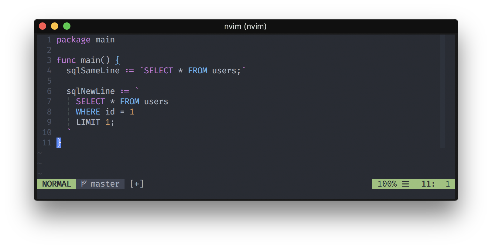

# Vim Go SQL

Highlight SQL syntax in Go strings.



## Install

### Vundle

```
Plugin 'droptheplot/vim-go-sql'
```

### Pathogen

```
git clone https://github.com/droptheplot/vim-go-sql.git ~/.vim/bundle/vim-go-sql
```

### vim-plug

```
Plug 'droptheplot/vim-go-sql'
```
